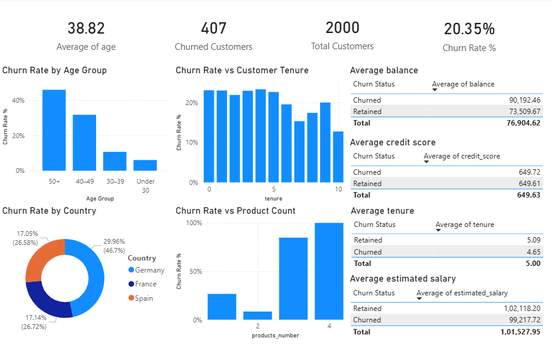

# Customer Churn Analysis (End-to-End ML + Power BI)


## 📌 Project Overview
This project analyzes customer churn using machine learning and visual analytics.
The goal is to identify **key drivers of churn** and present insights through an
**executive friendly Power BI dashboard**.

---

## 📂 Dataset
- **Source**: Bank Customer Churn dataset (public dataset)
- **Size**: ~2,000 customers
- **Target Variable**: `churn` (1 = Churned, 0 = Retained)
- **Key Features**:
  - Demographics: age, gender, country
  - Account info: tenure, number of products, credit score
  - Financials: balance, estimated salary
> Note: The dataset used is for educational purposes only.

---

🎯 Use Cases

- Identify high-risk customer segments likely to churn

- Support retention strategies by age, tenure, and product usage

- Help business teams prioritize customers for targeted offers

- Enable management to monitor churn KPIs in an interactive dashboard

- Provide a reusable churn analysis template for similar businesses

---

## 📊 Dashboard Preview


---

## 🧠 Business Questions Answered
- Which age groups churn the most?
- How does customer tenure affect churn?
- Does owning more products increase churn risk?
- Which countries have higher churn rates?
- How do financial indicators differ between churned vs retained customers?

---

## 🛠 Tech Stack
- **Python** (Pandas, Scikit-learn)
- **Machine Learning**: Logistic Regression, Random Forest
- **Visualization**: Power BI
- **Data**: Bank customer churn dataset

---

## 🔍 Key Insights
- Customers aged **50+** show the highest churn rate
- Churn decreases as **tenure increases**
- Customers with **3–4 products** churn significantly more
- **Germany** has the highest churn rate
- Churned customers have **higher average balances but shorter tenure**

---

## 📈 Results at a Glance
- Overall churn rate: **20.35%**
- Total customers analyzed: **2000**
- Churned customers: **407**
- Best performing model: **Random Forest**

---

## ⚙️ Workflow
1. Data cleaning & encoding (Python)
2. Model training & evaluation
3. Feature importance analysis
4. Export predictions for Power BI
5. Interactive dashboard creation

---

## 📁 Project Structure

```
churn-analysis/
├── data/
├── notebooks/
├── powerbi/
├── images/
├── README.md
└── requirements.txt
```

---

## ▶ How to Run

1. Clone repo
```
git clone https://github.com/AtharvaGhatwal/customer-churn-analysis.git
```
2. Install deps  
```
pip install -r requirements.txt
```
3. Run export script  
```
python data/data_check.py
```
4. Open dashboard  
```
Open the file in `powerbi/churn_dashboard.pbit` with Power BI Desktop
```

---

## 📌 Future Improvements
- Add predicted vs actual model validation visuals in dashboard
- Deploy ML model as API
- Add automated CI/CD for data/version control

---

### 📄 License

This project is licensed under the MIT License - see the [LICENSE](https://github.com/AtharvaGhatwal/customer-churn-analysis/blob/main/LICENSE) file for details.

```

MIT License

Copyright (c) 2026 Atharva Ghatwal

Permission is hereby granted, free of charge, to any person obtaining a copy
of this software and associated documentation files (the "Software"), to deal
in the Software without restriction, including without limitation the rights
to use, copy, modify, merge, publish, distribute, sublicense, and/or sell
copies of the Software, and to permit persons to whom the Software is
furnished to do so, subject to the following conditions:

The above copyright notice and this permission notice shall be included in all
copies or substantial portions of the Software.

THE SOFTWARE IS PROVIDED "AS IS", WITHOUT WARRANTY OF ANY KIND, EXPRESS OR
IMPLIED, INCLUDING BUT NOT LIMITED TO THE WARRANTIES OF MERCHANTABILITY,
FITNESS FOR A PARTICULAR PURPOSE AND NONINFRINGEMENT. IN NO EVENT SHALL THE
AUTHORS OR COPYRIGHT HOLDERS BE LIABLE FOR ANY CLAIM, DAMAGES OR OTHER
LIABILITY, WHETHER IN AN ACTION OF CONTRACT, TORT OR OTHERWISE, ARISING FROM,
OUT OF OR IN CONNECTION WITH THE SOFTWARE OR THE USE OR OTHER DEALINGS IN THE
SOFTWARE.

```

---

## 👨‍💼 Author

Atharva Ghatwal

📚 B.E. in Artificial Intelligence and Data Science

🔗  [](https://linkedin.com/in/atharvaghatwal)

🌐 [](https://github.com/AtharvaGhatwal)

---

## 🙏 Acknowledgements
- Dataset inspired by publicly available **bank customer churn datasets**
- Thanks to the open-source **Python** and **Power BI** communities for tools and resources
- Built as part of continuous learning in **machine learning and business analytics**

---

## 📞 Questions or Feedback?
Feel free to open an **Issue** or submit a **Pull Request** on GitHub.

---

⭐ If you found this project helpful, consider giving the repository a star!

---

**Last Updated:** January 2026
